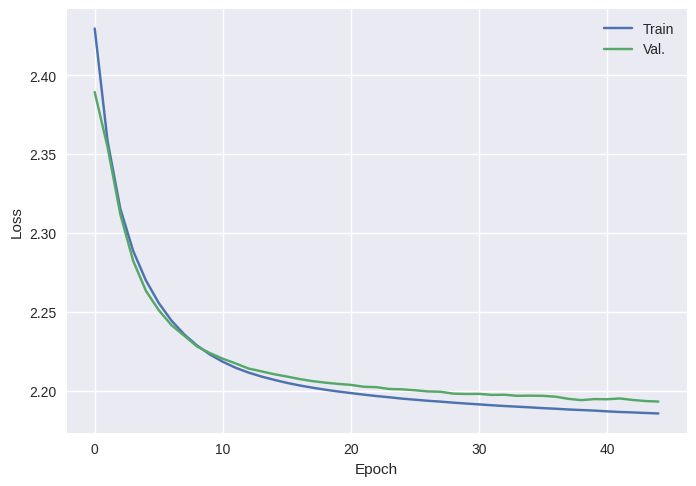
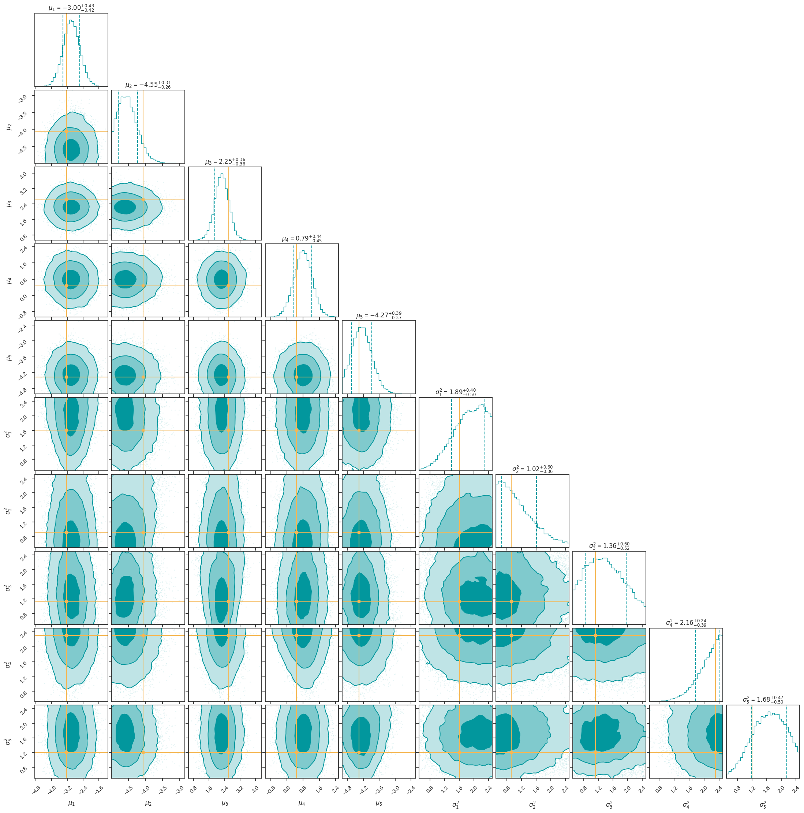
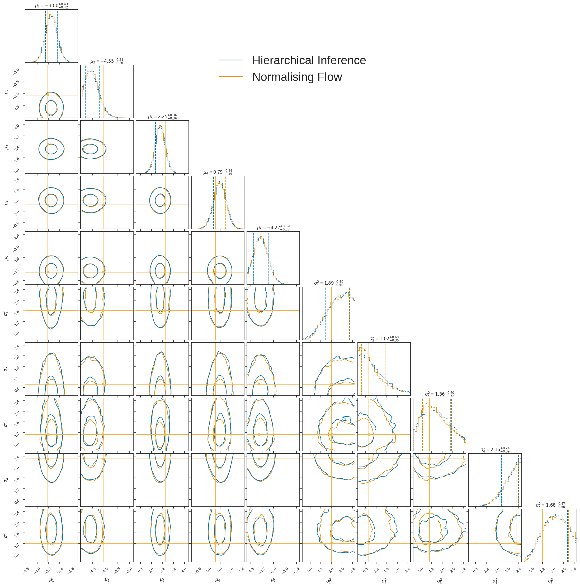

.. code:: ipython3

    import numpy as np
    from glasflow import CouplingNSF
    import matplotlib.pyplot as plt
    import torch
    import seaborn as sns
    from hierarchical_flow_tools import FlowLikelihood
    from nessai.flowsampler import FlowSampler
    from nessai.utils import setup_logger
    from nessai.plot import corner_plot
    from nessai.model import Model
    from hierarchical_flow_tools.models import NessaiModel
    torch.manual_seed(1729)
    np.random.seed(1729)

.. parsed-literal::

    glasflow is using its own internal version of nflows

Worked example of hierarchical inference with normalising flows
===============================================================

We wish to infer population parameters :math:`\lambda` from a set of
:math:`N` gravitational wave observations :math:`\{d\}`. For each set of
data :math:`d_i`, we obtain posterior samples :math:`\{\theta_i\}`.
Ignoring selection effects, the population posterior is

.. math::

   p(\lambda | \{\theta\}) = \prod _ {i = 0} ^ N \frac{1}{S_i} \sum _ {j = 0} ^ {S_i} \frac{\mathcal{L}(\theta_i | \lambda )}{\pi(\theta_i)}.

Let’s train a normalising flow to learn the distribution
:math:`\mathcal{L}(\theta_i | \lambda )`.

For a candidate example, we’re going to replace everything with
Gaussians. Our population is a multivariate, uncorrelated Gaussian with
mean :math:`\mu` and a diagonal covariance matrix with sigmas
:math:`\{\sigma_1,...,\sigma_5\}`. Each event is a Gaussian with 0.1
variance and a mean drawn from this population Gaussian.

Training the flow
~~~~~~~~~~~~~~~~~

We train the flow over some boundary of means and variances. We’ll say
the means are all within [-5, 5] and the variances between [0.5, 2.5].
For each population Gaussian, we draw one posterior sample for one
event.

.. code:: ipython3

    # construct the training and validation data
    train_means = np.random.uniform(-5, 5, size=(int(1e6), 5))
    train_variances = np.random.uniform(0.5, 2.5, size=(int(1e6), 5))
    
    x_train = np.array([np.random.multivariate_normal(m, np.eye(5)*v) for m,v in zip(train_means, train_variances)])
    y_train = np.concatenate([train_means, train_variances], axis=1)
    
    x_scaler = np.vstack([np.mean(x_train,axis=0), np.std(x_train,axis=0)])
    y_scaler = np.vstack([np.mean(y_train,axis=0),np.std(y_train,axis=0)])
    
    x_train = (x_train - x_scaler[0]) / x_scaler[1]
    y_train = (y_train - y_scaler[0]) / y_scaler[1]
    
    test_means = np.random.uniform(-5, 5, size=(int(1e4), 5))
    test_variances = np.random.uniform(0.5, 2.5, size=(int(1e4), 5))
    
    x_val = np.array([np.random.multivariate_normal(m, np.eye(5)*v) for m,v in zip(test_means, test_variances)])
    y_val = np.concatenate([test_means, test_variances], axis=1)
    
    x_val = (x_val - x_scaler[0]) / x_scaler[1]
    y_val = (y_val - y_scaler[0]) / y_scaler[1]

.. code:: ipython3

    batch_size = int(1e5)
    device = "cuda:0"
    flow = CouplingNSF(
        n_inputs=5,
        n_transforms=4,
        n_conditional_inputs=10,
        n_neurons=32,
        batch_norm_between_transforms=True,
    )
    flow.to(device)
    print(f"Created flow and sent to {device}")
    optimiser = torch.optim.Adam(flow.parameters())

.. parsed-literal::

    Created flow and sent to cuda:0

.. code:: ipython3

    x_train_tensor = torch.from_numpy(x_train.astype(np.float32))
    y_train_tensor = torch.from_numpy(y_train.astype(np.float32))
    train_dataset = torch.utils.data.TensorDataset(x_train_tensor, y_train_tensor)
    train_loader = torch.utils.data.DataLoader(
        train_dataset, batch_size=batch_size, shuffle=True
    )
    
    x_val_tensor = torch.from_numpy(x_val.astype(np.float32))
    y_val_tensor = torch.from_numpy(y_val.astype(np.float32))
    val_dataset = torch.utils.data.TensorDataset(x_val_tensor, y_val_tensor)
    val_loader = torch.utils.data.DataLoader(
        val_dataset, batch_size=batch_size, shuffle=False
    )

We train the flow for 50 epochs - this process could be optimised
further, but this works sufficiently well for this example.

.. code:: ipython3

    epochs = 50
    loss = dict(train=[], val=[])
    
    for i in range(epochs):
        flow.train()
        train_loss = 0.0
        for batch in train_loader:
            x, y = batch
            x = x.to(device)
            y = y.to(device)
            optimiser.zero_grad()
            _loss = -flow.log_prob(x, conditional=y).mean()
            _loss.backward()
            optimiser.step()
            train_loss += _loss.item()
        loss["train"].append(train_loss / len(train_loader))
    
        flow.eval()
        val_loss = 0.0
        for batch in val_loader:
            x, y = batch
            x = x.to(device)
            y = y.to(device)
            with torch.no_grad():
                _loss = -flow.log_prob(x, conditional=y).mean().item()
            val_loss += _loss
        loss["val"].append(val_loss / len(val_loader))
        if not i % 10:
            print(
                f"Epoch {i} - train: {loss['train'][-1]:.3f}, val: {loss['val'][-1]:.3f}"
            )
    
    flow.eval()
    print("Finished training")

.. parsed-literal::

    Epoch 0 - train: 6.756, val: 12.850
    Epoch 10 - train: 2.256, val: 2.251
    Epoch 20 - train: 2.205, val: 2.209
    Epoch 30 - train: 2.194, val: 2.200
    Epoch 40 - train: 2.189, val: 2.197
    Finished training

.. code:: ipython3

    with plt.style.context("seaborn"):
        plt.plot(loss["train"][5:], label="Train")
        plt.plot(loss["val"][5:], label="Val.")
        plt.xlabel("Epoch")
        plt.ylabel("Loss")
        plt.legend()
        plt.show()

Hierarchical inference
~~~~~~~~~~~~~~~~~~~~~~

With our trained flow in hand, we’re ready to do some hierarchical
inference. We’ll use the ``nessai`` nested sampler to infer our 10
hyperparameters, using the flow as a proxy for the likelihood as
described earlier.

Our “data” will consist of 10 events with 1000 posterior samples each,
where each event mean has been drawn from the population and the
variance is 0.05. For ease, we’ll just use the first events of our
validation set. Feel free to change these numbers and examine the
resulting change in the parameter estimation performance!

.. code:: ipython3

    event_mean = test_means[0]
    event_variance = test_variances[0]
    noise_variance = 0.05
    event_samples = np.array(
        [np.random.multivariate_normal(
            np.random.multivariate_normal(
                np.random.multivariate_normal(event_mean, np.eye(5)*event_variance), # determine the location of the event's true parameters
                np.eye(5)*noise_variance), # scatter the observed maximum likelihood location from the truth according to the posterior width
            np.eye(5)*noise_variance,size=1000) # draw 1000 "posterior samples" from this perturbed distribution
        for i in range(10)] # do this for all 10 events
    )
    
    event_samples_rescaled = (event_samples - x_scaler[0])/x_scaler[1]  # rescale these samples prior to inference

.. code:: ipython3

    # setup for nessai parameter estimation: we need to name the parameters and provide some prior bounds.
    names = [f"mu_{x}" for x in range(1,6)] + [f"sigma_{x}" for x in range(1,6)]
    bounds = dict()
    for k, n in enumerate(names):
        bounds[n] = [-5, 5] if k < 5 else [0.5,2.5]

.. code:: ipython3

    torch_yscaler = torch.as_tensor(y_scaler, device=device).float()
    flike = FlowLikelihood(
        flow, device, 
        data=torch.as_tensor(event_samples_rescaled, device=device).float(),
        batch_size=100,
        conditional_rescaling_function=lambda x: (x - torch_yscaler[0]) / torch_yscaler[1])
        
    model_fast = NessaiModel(names, bounds, flow_likelihood=flike)
    output_fast = './outdir_norm_fast'
    setup_logger(output=output_fast, log_level='CRITICAL')
    fs_fast = FlowSampler(model_fast, output=output_fast, resume=False, seed=1729, nlive=5000)
    fs_fast.run()

.. parsed-literal::

    Drawing live points: 100%|██████████| 5000/5000 [00:07<00:00, 629.89it/s]
    01-30 17:01 nessai.samplers.nestedsampler CRITICAL: Starting nested sampling loop
    01-30 17:11 nessai.samplers.base CRITICAL: Checkpointing nested sampling
    01-30 17:12 nessai.samplers.nestedsampler CRITICAL: Final evidence: -37.947 +/- 0.046
    01-30 17:12 nessai.samplers.nestedsampler CRITICAL: Information: 10.63
    01-30 17:12 nessai.samplers.nestedsampler CRITICAL: Final p-value for the insertion indices is less than 0.05, this could be an indication of problems during sampling. Consider checking the diagnostic plots.
    01-30 17:12 nessai.samplers.base CRITICAL: Checkpointing nested sampling

.. code:: ipython3

    with plt.style.context("seaborn"):
        truths = event_mean.tolist() + event_variance.tolist()
        corner_fig = corner_plot(
            fs_fast.posterior_samples,
            include=names,
            truths=truths,
            labels=[rf"$\mu_{x}$" for x in range(1,6)] + [rf"$\sigma^2_{x}$" for x in range(1,6)],
        )
        corner_fig.savefig(output_fast+'/posterior_w_truth.png')
        plt.show()

We have an answer and it looks reasonable. To see if it’s trustworthy we
can directly perform the hierarchical inference in this case and see if
the results are consistent…

Analytic Hierarchical Inference (comparison)
~~~~~~~~~~~~~~~~~~~~~~~~~~~~~~~~~~~~~~~~~~~~

.. code:: ipython3

    #nessai model class
    class HierarchicalModel(Model):
        """A simple Gaussian likelihood."""
    
        def __init__(self, names, bounds, data):
            # Names of parameters to sample
            self.names = names
            # Prior bounds for each parameter
            self.bounds = bounds
            self.data = torch.as_tensor(data).float().to(device)#.reshape(-1,data.shape[-1])
            self.nsamp = data.shape[1] 
            self.nevents = data.shape[0]
            self._vectorised_likelihood = False #bad 
    
        def unpack_live_point(self, x):
            start = np.array([x[n] for n in self.names]).T
            if start.ndim == 1:
                start = start[None,:]
            return torch.Tensor(start).float().to(device)
    
        def log_prior(self, x):
            """
            Returns log of prior given a live point assuming uniform
            priors on each parameter.
            """
            # Check if values are in bounds, returns True/False
            # Then take the log to get 0/-inf and make sure the dtype is float
            log_p = np.log(self.in_bounds(x), dtype="float").astype(np.float32)
            # Iterate through each parameter (x and y)
            # since the live points are a structured array we can
            # get each value using just the name
            for n in self.names:
                log_p -= np.log(self.bounds[n][1] - self.bounds[n][0])
            return log_p
    
        def log_likelihood(self, x):
            try:
                if len(x[self.names[0]]) > 1:
                    raise NotImplementedError
            except TypeError:
                pass
            conditional = self.unpack_live_point(x)
            log_prob = 0
            for event_data in self.data:
                with torch.no_grad():
                    diff = (event_data - conditional[:,:5])
                    detcov = torch.prod(conditional[:,5:],dim=-1)
                    probs = -0.5*(diff**2 * conditional[:,5:]**-1).sum(axis=-1) - 0.5*torch.log(detcov) - 5/2 * np.log(2*np.pi)
                    log_prob += (torch.logsumexp(probs,dim=-1).cpu().numpy() - np.log(self.nsamp))
            return log_prob

.. code:: ipython3

    model2 = HierarchicalModel(names, bounds, data=event_samples)
    output2 = './outdir_norm_hierarchical'
    setup_logger(output=output2, log_level='WARNING')
    fs2 = FlowSampler(model2, output=output2, resume=False, seed=1729, nlive=5000)
    fs2.run()

.. parsed-literal::

    01-30 16:29 nessai.model WARNING : Multiprocessing pool has already been configured.
    01-30 16:29 nessai.samplers.nestedsampler WARNING : Proposal will only train when empty
    Drawing live points: 100%|██████████| 5000/5000 [00:19<00:00, 255.92it/s]
    01-30 16:29 nessai.samplers.nestedsampler CRITICAL: Starting nested sampling loop
    01-30 16:30 nessai.samplers.nestedsampler WARNING : it:  5000: Rolling KS test: D=0.01, p-value=0.3654
    01-30 16:30 nessai.samplers.nestedsampler WARNING : it:  5000: n eval: 15000 H: 5.16 dZ: 269.147 logZ: -358.940 +/- 0.032 logLmax: -88.79
    01-30 16:31 nessai.samplers.nestedsampler WARNING : it: 10000: Rolling KS test: D=0.0032, p-value=0.9007
    01-30 16:31 nessai.samplers.nestedsampler WARNING : it: 10000: n eval: 40000 H: 5.38 dZ: 150.803 logZ: -241.596 +/- 0.033 logLmax: -88.79
    01-30 16:31 nessai.samplers.nestedsampler WARNING : Switching to FlowProposal
    01-30 16:32 nessai.samplers.nestedsampler WARNING : it: 15000: Rolling KS test: D=0.0108, p-value=0.3093
    01-30 16:32 nessai.samplers.nestedsampler WARNING : it: 15000: n eval: 59542 H: 5.82 dZ: 92.078 logZ: -180.633 +/- 0.034 logLmax: -85.55
    01-30 16:33 nessai.samplers.nestedsampler WARNING : it: 20000: Rolling KS test: D=0.0132, p-value=0.1736
    01-30 16:33 nessai.samplers.nestedsampler WARNING : it: 20000: n eval: 67335 H: 6.25 dZ: 57.646 logZ: -146.246 +/- 0.035 logLmax: -84.60
    01-30 16:33 nessai.evidence WARNING : NS integrator received non-monotonic logL.-137.01409 -> -137.01409
    01-30 16:33 nessai.evidence WARNING : NS integrator received non-monotonic logL.-123.37438 -> -123.37438
    01-30 16:34 nessai.samplers.nestedsampler WARNING : it: 25000: Rolling KS test: D=0.007, p-value=0.6098
    01-30 16:34 nessai.samplers.nestedsampler WARNING : it: 25000: n eval: 82628 H: 6.71 dZ: 38.665 logZ: -126.157 +/- 0.037 logLmax: -82.49
    01-30 16:34 nessai.samplers.nestedsampler WARNING : it: 30000: Rolling KS test: D=0.0044, p-value=0.8216
    01-30 16:35 nessai.samplers.nestedsampler WARNING : it: 30000: n eval: 90666 H: 7.17 dZ: 25.565 logZ: -114.056 +/- 0.038 logLmax: -82.49
    01-30 16:35 nessai.samplers.nestedsampler WARNING : it: 35000: Rolling KS test: D=0.009, p-value=0.4422
    01-30 16:36 nessai.samplers.nestedsampler WARNING : it: 35000: n eval: 106992 H: 7.66 dZ: 17.960 logZ: -106.791 +/- 0.039 logLmax: -81.83
    01-30 16:36 nessai.evidence WARNING : NS integrator received non-monotonic logL.-94.78463 -> -94.78463
    01-30 16:36 nessai.evidence WARNING : NS integrator received non-monotonic logL.-93.53537 -> -93.53537
    01-30 16:36 nessai.samplers.nestedsampler WARNING : it: 40000: Rolling KS test: D=0.0082, p-value=0.5077
    01-30 16:36 nessai.samplers.nestedsampler WARNING : it: 40000: n eval: 115465 H: 8.14 dZ: 12.401 logZ: -102.212 +/- 0.040 logLmax: -81.81
    01-30 16:37 nessai.samplers.nestedsampler WARNING : it: 45000: Rolling KS test: D=0.0164, p-value=0.06717
    01-30 16:37 nessai.samplers.nestedsampler WARNING : it: 45000: n eval: 132541 H: 8.57 dZ: 8.826 logZ: -99.433 +/- 0.041 logLmax: -81.61
    01-30 16:38 nessai.samplers.nestedsampler WARNING : it: 50000: Rolling KS test: D=0.0026, p-value=0.933
    01-30 16:38 nessai.samplers.nestedsampler WARNING : it: 50000: n eval: 149787 H: 8.99 dZ: 6.529 logZ: -97.717 +/- 0.042 logLmax: -81.19
    01-30 16:38 nessai.evidence WARNING : NS integrator received non-monotonic logL.-87.02088 -> -87.02088
    01-30 16:38 nessai.evidence WARNING : NS integrator received non-monotonic logL.-86.95438 -> -86.95438
    01-30 16:39 nessai.evidence WARNING : NS integrator received non-monotonic logL.-86.04286 -> -86.04286
    01-30 16:39 nessai.evidence WARNING : NS integrator received non-monotonic logL.-85.98847 -> -85.98847
    01-30 16:39 nessai.evidence WARNING : NS integrator received non-monotonic logL.-85.84612 -> -85.84612
    01-30 16:39 nessai.samplers.nestedsampler WARNING : it: 55000: Rolling KS test: D=0.0144, p-value=0.1245
    01-30 16:39 nessai.samplers.nestedsampler WARNING : it: 55000: n eval: 158741 H: 9.40 dZ: 4.608 logZ: -96.629 +/- 0.043 logLmax: -81.03
    01-30 16:39 nessai.samplers.base CRITICAL: Checkpointing nested sampling
    01-30 16:39 nessai.evidence WARNING : NS integrator received non-monotonic logL.-85.53402 -> -85.53402
    01-30 16:39 nessai.evidence WARNING : NS integrator received non-monotonic logL.-84.97919 -> -84.97919
    01-30 16:39 nessai.evidence WARNING : NS integrator received non-monotonic logL.-84.92502 -> -84.92502
    01-30 16:40 nessai.samplers.nestedsampler WARNING : it: 60000: Rolling KS test: D=0.012, p-value=0.235
    01-30 16:40 nessai.samplers.nestedsampler WARNING : it: 60000: n eval: 176425 H: 9.75 dZ: 3.064 logZ: -95.951 +/- 0.044 logLmax: -80.93
    01-30 16:40 nessai.evidence WARNING : NS integrator received non-monotonic logL.-84.37653 -> -84.37653
    01-30 16:40 nessai.evidence WARNING : NS integrator received non-monotonic logL.-84.34099 -> -84.34099
    01-30 16:40 nessai.evidence WARNING : NS integrator received non-monotonic logL.-84.25258 -> -84.25258
    01-30 16:40 nessai.evidence WARNING : NS integrator received non-monotonic logL.-83.79962 -> -83.79962
    01-30 16:41 nessai.samplers.nestedsampler WARNING : it: 65000: Rolling KS test: D=0.0152, p-value=0.09822
    01-30 16:41 nessai.samplers.nestedsampler WARNING : it: 65000: n eval: 195077 H: 10.04 dZ: 2.059 logZ: -95.537 +/- 0.045 logLmax: -80.62
    01-30 16:41 nessai.evidence WARNING : NS integrator received non-monotonic logL.-83.64220 -> -83.64220
    01-30 16:41 nessai.evidence WARNING : NS integrator received non-monotonic logL.-83.61098 -> -83.61098
    01-30 16:41 nessai.evidence WARNING : NS integrator received non-monotonic logL.-83.35493 -> -83.35493
    01-30 16:41 nessai.evidence WARNING : NS integrator received non-monotonic logL.-83.28922 -> -83.28922
    01-30 16:42 nessai.evidence WARNING : NS integrator received non-monotonic logL.-83.27466 -> -83.27466
    01-30 16:42 nessai.evidence WARNING : NS integrator received non-monotonic logL.-83.23347 -> -83.23347
    01-30 16:42 nessai.evidence WARNING : NS integrator received non-monotonic logL.-83.23044 -> -83.23044
    01-30 16:42 nessai.evidence WARNING : NS integrator received non-monotonic logL.-83.20265 -> -83.20265
    01-30 16:42 nessai.evidence WARNING : NS integrator received non-monotonic logL.-83.12969 -> -83.12969
    01-30 16:42 nessai.evidence WARNING : NS integrator received non-monotonic logL.-83.10516 -> -83.10516
    01-30 16:42 nessai.evidence WARNING : NS integrator received non-monotonic logL.-82.98978 -> -82.98978
    01-30 16:42 nessai.samplers.nestedsampler WARNING : it: 70000: Rolling KS test: D=0.0232, p-value=0.004524
    01-30 16:42 nessai.samplers.nestedsampler WARNING : it: 70000: n eval: 204212 H: 10.26 dZ: 1.285 logZ: -95.291 +/- 0.045 logLmax: -80.33
    01-30 16:42 nessai.evidence WARNING : NS integrator received non-monotonic logL.-82.95760 -> -82.95760
    01-30 16:42 nessai.evidence WARNING : NS integrator received non-monotonic logL.-82.95578 -> -82.95578
    01-30 16:42 nessai.evidence WARNING : NS integrator received non-monotonic logL.-82.75227 -> -82.75227
    01-30 16:42 nessai.evidence WARNING : NS integrator received non-monotonic logL.-82.73243 -> -82.73243
    01-30 16:42 nessai.evidence WARNING : NS integrator received non-monotonic logL.-82.60383 -> -82.60383
    01-30 16:43 nessai.evidence WARNING : NS integrator received non-monotonic logL.-82.49562 -> -82.49562
    01-30 16:43 nessai.evidence WARNING : NS integrator received non-monotonic logL.-82.41852 -> -82.41852
    01-30 16:43 nessai.samplers.nestedsampler WARNING : it: 75000: Rolling KS test: D=0.0164, p-value=0.06717
    01-30 16:43 nessai.samplers.nestedsampler WARNING : it: 75000: n eval: 222372 H: 10.43 dZ: 0.657 logZ: -95.148 +/- 0.046 logLmax: -80.22
    01-30 16:43 nessai.evidence WARNING : NS integrator received non-monotonic logL.-82.37474 -> -82.37474
    01-30 16:43 nessai.evidence WARNING : NS integrator received non-monotonic logL.-82.26591 -> -82.26591
    01-30 16:44 nessai.evidence WARNING : NS integrator received non-monotonic logL.-82.17277 -> -82.17277
    01-30 16:44 nessai.evidence WARNING : NS integrator received non-monotonic logL.-82.11172 -> -82.11172
    01-30 16:44 nessai.evidence WARNING : NS integrator received non-monotonic logL.-82.10704 -> -82.10704
    01-30 16:44 nessai.evidence WARNING : NS integrator received non-monotonic logL.-82.06967 -> -82.06967
    01-30 16:44 nessai.evidence WARNING : NS integrator received non-monotonic logL.-82.02911 -> -82.02911
    01-30 16:44 nessai.evidence WARNING : NS integrator received non-monotonic logL.-81.97727 -> -81.97727
    01-30 16:44 nessai.evidence WARNING : NS integrator received non-monotonic logL.-81.96682 -> -81.96682
    01-30 16:44 nessai.evidence WARNING : NS integrator received non-monotonic logL.-81.96074 -> -81.96074
    01-30 16:44 nessai.samplers.nestedsampler WARNING : it: 80000: Rolling KS test: D=0.0152, p-value=0.09822
    01-30 16:44 nessai.samplers.nestedsampler WARNING : it: 80000: n eval: 239922 H: 10.55 dZ: 0.274 logZ: -95.068 +/- 0.046 logLmax: -80.22
    01-30 16:44 nessai.evidence WARNING : NS integrator received non-monotonic logL.-81.83495 -> -81.83495
    01-30 16:44 nessai.evidence WARNING : NS integrator received non-monotonic logL.-81.83467 -> -81.83467
    01-30 16:44 nessai.evidence WARNING : NS integrator received non-monotonic logL.-81.76911 -> -81.76911
    01-30 16:44 nessai.evidence WARNING : NS integrator received non-monotonic logL.-81.76297 -> -81.76297
    01-30 16:44 nessai.evidence WARNING : NS integrator received non-monotonic logL.-81.75264 -> -81.75264
    01-30 16:45 nessai.evidence WARNING : NS integrator received non-monotonic logL.-81.72926 -> -81.72926
    01-30 16:45 nessai.evidence WARNING : NS integrator received non-monotonic logL.-81.72684 -> -81.72684
    01-30 16:45 nessai.evidence WARNING : NS integrator received non-monotonic logL.-81.69954 -> -81.69954
    01-30 16:45 nessai.evidence WARNING : NS integrator received non-monotonic logL.-81.68073 -> -81.68073
    01-30 16:45 nessai.evidence WARNING : NS integrator received non-monotonic logL.-81.62568 -> -81.62568
    01-30 16:45 nessai.evidence WARNING : NS integrator received non-monotonic logL.-81.62022 -> -81.62022
    01-30 16:45 nessai.evidence WARNING : NS integrator received non-monotonic logL.-81.61221 -> -81.61221
    01-30 16:45 nessai.evidence WARNING : NS integrator received non-monotonic logL.-81.60089 -> -81.60089
    01-30 16:45 nessai.evidence WARNING : NS integrator received non-monotonic logL.-81.58610 -> -81.58610
    01-30 16:45 nessai.evidence WARNING : NS integrator received non-monotonic logL.-81.57385 -> -81.57385
    01-30 16:45 nessai.samplers.nestedsampler WARNING : it: 85000: Rolling KS test: D=0.0108, p-value=0.3093
    01-30 16:45 nessai.samplers.nestedsampler WARNING : it: 85000: n eval: 248631 H: 10.62 dZ: 0.106 logZ: -95.027 +/- 0.046 logLmax: -80.22
    01-30 16:45 nessai.evidence WARNING : NS integrator received non-monotonic logL.-81.56876 -> -81.56876
    01-30 16:45 nessai.evidence WARNING : NS integrator received non-monotonic logL.-81.55365 -> -81.55365
    01-30 16:45 nessai.evidence WARNING : NS integrator received non-monotonic logL.-81.51034 -> -81.51034
    01-30 16:45 nessai.evidence WARNING : NS integrator received non-monotonic logL.-81.48447 -> -81.48447
    01-30 16:45 nessai.evidence WARNING : NS integrator received non-monotonic logL.-81.40493 -> -81.40493
    01-30 16:45 nessai.evidence WARNING : NS integrator received non-monotonic logL.-81.29644 -> -81.29644
    01-30 16:45 nessai.evidence WARNING : NS integrator received non-monotonic logL.-81.14983 -> -81.14983
    01-30 16:45 nessai.samplers.nestedsampler CRITICAL: Final evidence: -94.989 +/- 0.046
    01-30 16:45 nessai.samplers.nestedsampler CRITICAL: Information: 10.70
    01-30 16:45 nessai.samplers.nestedsampler WARNING : Final KS test: D=0.004896, p-value=0.01672
    01-30 16:45 nessai.samplers.nestedsampler CRITICAL: Final p-value for the insertion indices is less than 0.05, this could be an indication of problems during sampling. Consider checking the diagnostic plots.
    01-30 16:45 nessai.samplers.base CRITICAL: Checkpointing nested sampling

.. code:: ipython3

    with plt.style.context("seaborn"):
        pal = sns.color_palette(palette="colorblind").as_hex()
    
        truths = event_mean.tolist() + event_variance.tolist()
        corner_fig = corner_plot(
            fs2.posterior_samples,
            color=pal[1],
            include=names,
            truths=truths,
            labels=[rf"$\mu_{x}$" for x in range(1,6)] + [rf"$\sigma^2_{x}$" for x in range(1,6)],
            hist_kwargs=dict(density=True,color=pal[1]),
            plot_density=False,
            plot_datapoints=False,
            fill_contours=False,
            levels = (1 - np.exp(-0.5), 1-np.exp(-2))
        )
    
        corner_fig2 = corner_plot(
            fs_fast.posterior_samples,
            color=pal[0],
            include=names,
            truths=truths,
            labels=[rf"$\mu_{x}$" for x in range(1,6)] + [rf"$\sigma^2_{x}$" for x in range(1,6)],
            fig = corner_fig,
            hist_kwargs=dict(density=True,color=pal[0]),
            plot_density=False,
            plot_datapoints=False,
            fill_contours=False,
            levels = (1 - np.exp(-0.5), 1-np.exp(-2))
        )
    
        import matplotlib.lines as mlines
        blue = mlines.Line2D([],[], color=pal[0], label='Hierarchical Inference')
        orange = mlines.Line2D([],[], color=pal[1], label='Normalising Flow')
        corner_fig2.legend(handles=[blue, orange], loc=(0.37,0.85),fontsize=32, frameon=False)
        corner_fig2.savefig('joint_posterior_w_truth.png')
        plt.show()

